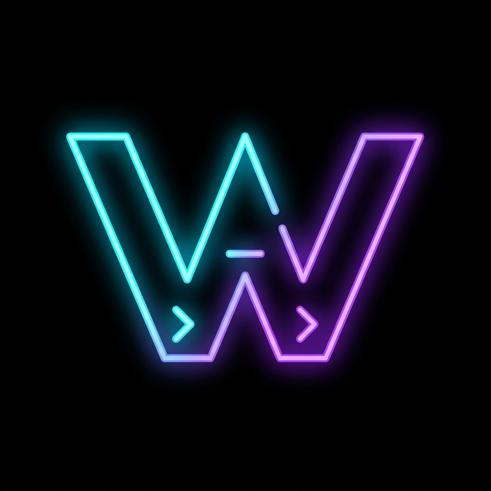

# Waz

[English](./README.md) · [Simplified Chinese](./README.zh-CN.md)
<i>Now は <a href="https://github.com/warpdotdev/warp">Warp</a> をベースにしていますが、From now on I will evolve alone. </i>

Waz はオープンでローカルファーストなターミナルで、AI と Agentをファーストクラスでサポートします. Any AI プロバイダーを涚し, Any の CLI Agent をGET り込み, ターミナル内で SSH ホストを Management——API キー・歴・AgentのSTATE はデフォルトで自分のマシンにstay まります.
## Formula Warp に対して Waz がAdditional function
- **クラウドRequiredなし**——アカウント、ログイン、Drive same period、クラウド Agent 譴のいずれもNot required.- **BYOP な AI プロバイダー** ——Any の OpenAI interchange エンドポイントに加え、OpenAI / Anthropic / Gemini / DeepSeek / Ollamaのネイティブプロトコル. API キーはローカルに remains.- **サードパーティ CLI Agent** —— DeepSeek-TUI / Codex CLI / Claude Code / Google Antigravity (`agy`) を Block とNotification センターに integration.- **内蔵 SSH ホストマネージャー** - ターミナル内でホスト・Settings・セッションをManagement, tmux and linkage.- **Compilation possibleなシステムプロンプト** - minijinja テンプレートをクライアントlateral でレンダリング.- **レンダリング Improvement** - Markdown パイプラインのチューニング, CJK ソフトラップ caretと太子サブピクセルの was corrected.- **Multi-language UI** - English/Simplified Chinese/Japanese をデフォルト同梱、コミュニティで拡张 possibility.- **プライバシー PRIORITYのデフォルト** —— Cloud Agent / Computer Use / Referral / テレメトリはデフォルトでオフ.
## OpenWarp / Warp からの migrate
プロジェクトが Waz に was renamed as される前から使っていた方 (the name at that time was **OpenWarp**),または上上 **Warp** から multiply りfor えるsquareは、[docs/migrate-from-warp.ja.md](docs/migrate-from-warp.ja.md) をReferenceしてSETをHide き継いでください.
## ロードマップ

[docs/roadmap.ja.md](docs/roadmap.ja.md) をReferenceしてください.
## Thank you
- [Warp](https://github.com/warpdotdev/warp) —— Waz がベースとしている上流のターミナル.- [DeepSeek-TUI](https://github.com/Hmbown/DeepSeek-TUI) —— 深く合合された CLI Agent パートナー.
